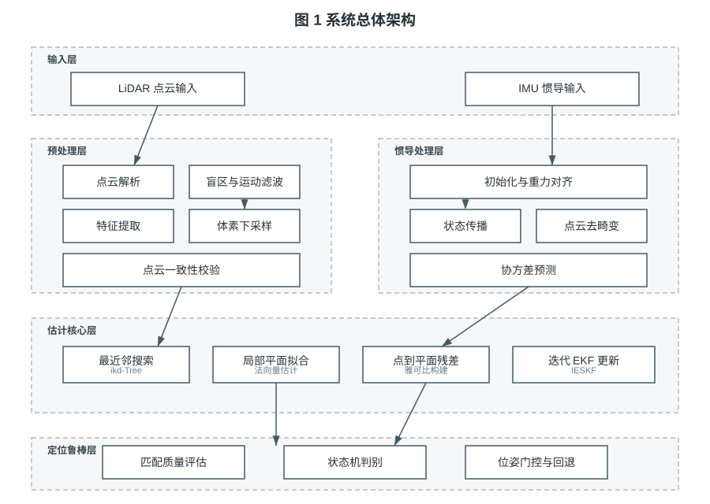
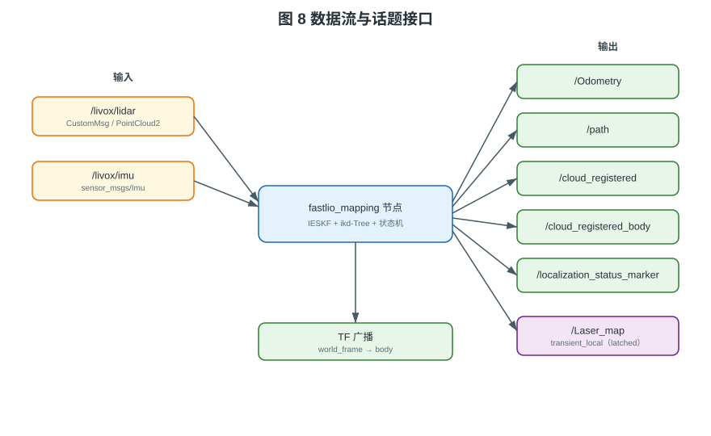
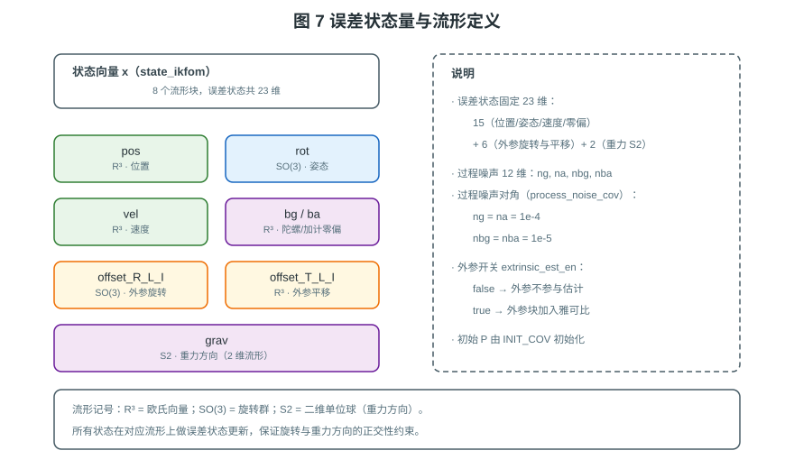
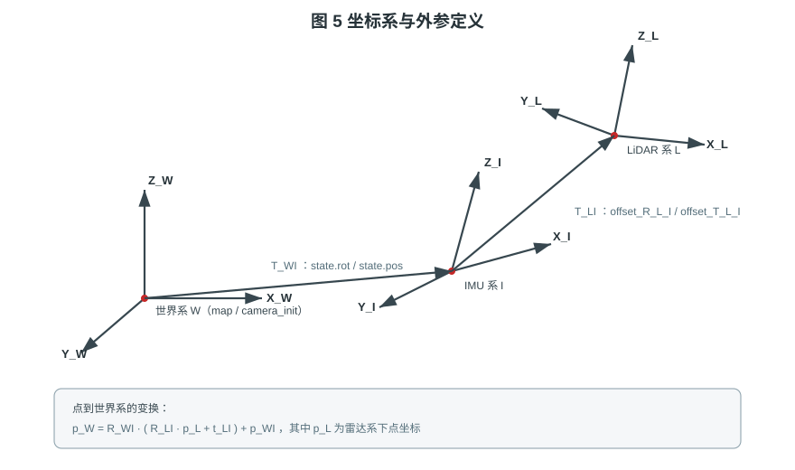
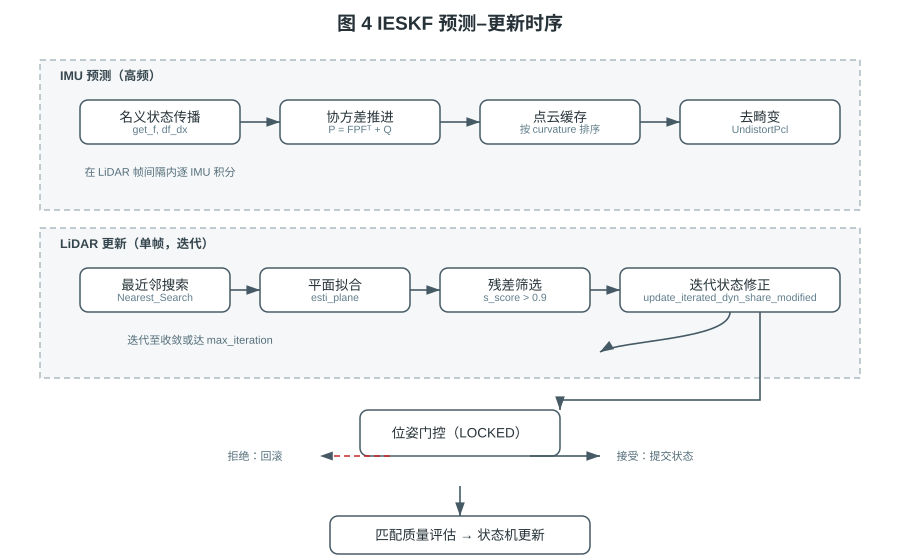
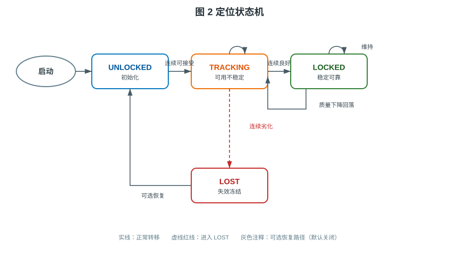
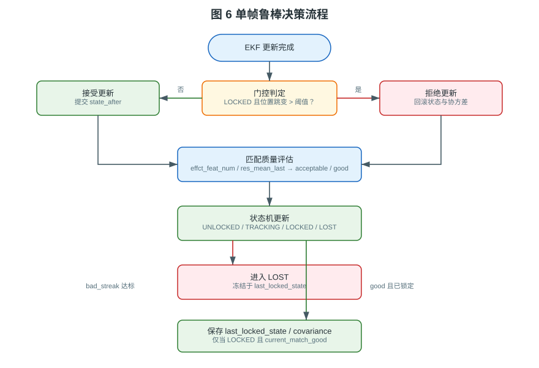
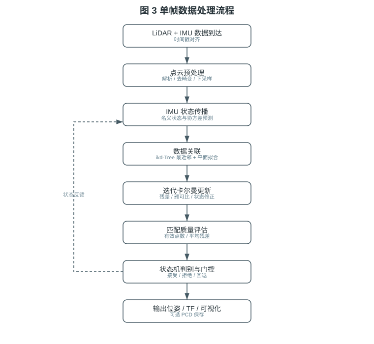

# Fixed Prior-Map LiDAR Localization

<p align="center">
  <a href="README.md">简体中文</a> |
  <a href="README_EN.md">English</a>
</p>


> **Scope**: A LiDAR localization system for a **known prior map**, designed to be
> validated in **simulation environments and public datasets**.
> **Context**: This is a **robotics course project**, built upon the LiDAR-inertial
> odometry and state-estimation methods learned in the **Shenlan College
> "Multi-Sensor Fusion" course**.
> **Note: this repository does not currently ship any experimental data or
> evaluation results** — [§8](#8-experimental-design-plan) is an experimental
> **design (plan)**, not completed results. [§12](#12-recommended-real-world-setup)
> gives a recommended hardware setup.

---

## Table of Contents

1. [Background and Problem Definition](#1-background-and-problem-definition)
2. [Methodology](#2-methodology)
3. [System Architecture](#3-system-architecture)
4. [Differences from Upstream FAST-LIO (ROS 2 Version)](#4-differences-from-upstream-fast-lio-ros-2-version)
5. [State Estimation](#5-state-estimation)
6. [Localization State Machine](#6-localization-state-machine)
7. [Robustness Mechanism](#7-robustness-mechanism)
8. [Experimental Design (Plan)](#8-experimental-design-plan)
9. [Quick Start](#9-quick-start)
10. [Parameters](#10-parameters)
11. [Topic Interface](#11-topic-interface)
12. [Recommended Real-World Setup](#12-recommended-real-world-setup)
13. [Reproduction Steps (Plan)](#13-reproduction-steps-plan)
14. [Engineering Methodology](#14-engineering-methodology)
15. [Repository Layout](#15-repository-layout)
16. [License and Acknowledgements](#16-license-and-acknowledgements)

---

## 1. Background and Problem Definition

### 1.1 Background

Classical LiDAR-inertial odometry (LIO) is built on **online incremental
mapping**, targeting unknown-environment exploration. In inspection, warehousing,
and UAV station-keeping, the map is often **available in advance**, so the
requirement shifts from *incremental mapping* to **stable localization in a known
map**.

Reusing an LIO mapping framework introduces two problems:

1. **Map contamination** — online insertion/deletion breaks prior-map consistency;
2. **Unawareness of failure** — under degradation (sparse features, occlusion,
   kidnapping) the system keeps outputting wrong poses with no fallback.

### 1.2 Problem Definition

Given a prior point-cloud map $\mathcal{M}$ and a real-time LiDAR/IMU stream,
estimate the pose $\mathbf{T}_k \in SE(3)$ while also outputting a **localization
confidence state** $s_k$, such that the pose error is bounded during normal
operation and the system **detects failure** and **rolls back to the last
reliable pose** under degradation.

Formally, with estimate $\hat{\mathbf{T}}_k$ and ground truth $\mathbf{T}_k^{*}$:

$$
\left\| \log\!\left( \mathbf{T}_k^{*\,\top} \hat{\mathbf{T}}_k \right) \right\| \le \varepsilon \quad \text{when } s_k \in \{\text{TRACKING}, \text{LOCKED}\}
$$

and the output is frozen at the last reliable frame when $s_k = \text{LOST}$.

### 1.3 Design Goals

| ID | Goal | Mechanism | Source |
| :-- | :-- | :-- | :-- |
| G1 | Fixed-map localization, no online edits | One-shot ikd-Tree | `init_localization_map_from_prior()` |
| G2 | Reuse a mature estimator | scan-to-map + IESKF | `h_share_model()` / `process_one_frame()` |
| G3 | Detectable failure | Match quality + 4-state machine | `state_machine.hpp` |
| G4 | Recoverable failure | Pose gating + last-reliable rollback | `pose_gate.hpp` / `process_one_frame()` |
| G5 | Reproducibility | provide simulation/dataset configs and unit tests | `test/test_state_machine.cpp`, `config/marsim.yaml` |

---

## 2. Methodology

### 2.1 Core Idea: Decoupling Estimation from Confidence

The system separates "how the pose is computed" from "whether the pose is
trustworthy" into two independent chains.

| Layer | Responsibility | Unit-testable | Key files |
| :-- | :-- | :-- | :-- |
| Estimation | pose/velocity/bias/extrinsic/gravity | data-dependent | `IMU_Processing.hpp`, `fastlio_node.cpp` |
| Robustness | quality, transitions, gating, rollback | **pure logic, testable** | `localization/state_machine.hpp`, `localization/pose_gate.hpp` |

**Why split?** Robustness tuning changes frequently; coupling it to the estimator
would force a full EKF regression each time. As pure logic (input `MatchQuality`,
output state), the robustness layer is testable without ROS or point clouds —
which is exactly why `test_state_machine.cpp` can cover transition boundaries.

### 2.2 Design Trade-offs

| Decision | Chosen | Alternative | Rationale |
| :-- | :-- | :-- | :-- |
| Prior-map index | ikd-Tree | plain kd-tree / voxel hash | efficient NN, mature |
| Estimator | reuse IESKF as main estimator | replace IESKF with NDT | reuse mature backbone; NDT is only a **recovery backend** (see §4.6), not a replacement estimator |
| Failure handling | state machine + gating | threshold alarm only | provides an actionable fallback |
| Robustness form | pure-logic headers | inline in main node | testable, tunable |
| Gating semantics | **decoupled** from quality | single combined score | avoids misclassification (§6.3) |

### 2.3 Key Engineering Hardening

| Area | Issue | Handling | Location |
| :-- | :-- | :-- | :-- |
| Numerics | `acos` input out of range | clamp to $[-1,1]$ | `so3_math.h` / `Exp_mat.h` |
| Numerics | zero-norm plane normal | lower bound `1e-12` | `common_lib.h::esti_normvector` |
| Numerics | degenerate-neighbor angle misclassification | zero norm → `continue` | `preprocess.cpp` |
| Concurrency | `std::vector<bool>` bit-packing race | `std::vector<uint8_t>` | `fastlio_node.cpp` |
| Memory | PCL container indexing after `clear()` | `resize` to input size | `h_share_model` |
| Time | non-normalized ROS 2 split | carry normalization | `common_lib.h::sec_to_stamp` |
| Stability | unbounded path growth | decimation + length cap | `publish_path()` |
| Stability | per-frame log spam | `RCLCPP_INFO_THROTTLE` | `preprocess.cpp` |

---

## 3. System Architecture



**Figure 1** — five layers: input, pre-processing, inertial processing,
estimation core, and robustness. Decoupling estimation from robustness is the
design thread.

### 3.1 Data Flow and Topics



**Figure 8** — node I/O over ROS topics: LiDAR/IMU input; odometry, path,
registered clouds, status marker, and latched prior-map output.

---

## 4. Differences from Upstream FAST-LIO (ROS 2 Version)

> This section lists **verifiable code/structure-level facts only**. It contains
> **no quantitative performance comparison** — the repository ships no
> experimental data (see [§8](#8-experimental-design-plan)), so no accuracy gain
> is claimed.
> **This repository is the ROS 2 (Humble) version**: upstream `hku-mars/FAST_LIO`
> is a ROS 1 package; this project is a **ROS 2 port plus functional extensions**.

### 4.1 Platform Port: ROS 1 → ROS 2

| Aspect | Upstream FAST-LIO | This project (ROS 2 version) |
| :-- | :-- | :-- |
| Middleware | ROS 1 (`roscpp`, Melodic+) | **ROS 2 Humble (`rclcpp`)** |
| Build | `catkin_make` | **`ament_cmake` + `colcon`** |
| Node structure | single-file `laserMapping.cpp` + globals | **modular `FastLioNode` class** (`src/fastlio_node.cpp`), no globals |
| Parameters | ROS 1 parameter server | **ROS 2 `declare_parameter` + YAML** (`/**/ros__parameters`) |
| LiDAR driver | `livox_ros_driver` | **`livox_ros_driver2`** (`CustomMsg`) |
| Status viz | `jsk_rviz_plugins` OverlayText | standard **`visualization_msgs/Marker`** (native in rviz2) |
| Time type | `ros::Time` | `builtin_interfaces` + **normalized `sec_to_stamp`** |
| Launch | `*.launch` (XML) | **`*.launch.py`** (Python) |
| Messages | `message_generation` | **`rosidl_default_generators`** |
| Unit tests | none | **`test/test_state_machine.cpp`** (GTest, no ROS) |

### 4.2 New Capability: Fixed Prior-Map Localization (absent upstream)

Upstream provides **online incremental mapping only**. This project adds
`MODE_LOCALIZATION` (`run_mode: 1`):

| Capability | Upstream | This project | Source |
| :-- | :--: | :--: | :-- |
| Prior PCD map loading | ✗ | ✅ | `load_prior_map_from_pcd()` |
| Prior-map voxel downsampling | ✗ | ✅ | `init_localization_map_from_prior()` |
| One-shot ikd-Tree, online edits disabled | ✗ | ✅ | `init_localization_map_from_prior()` |
| Latched prior-map publishing | ✗ | ✅ | `/Laser_map` (`transient_local`) |
| Dual run modes (mapping / localization) | ✗ | ✅ | `RunMode` / `run_mode` |

### 4.3 New Capability: Localization Robustness (absent upstream)

Upstream keeps outputting a pose under degradation with no failure handling.
This project adds a dedicated robustness layer:

| Mechanism | Upstream | This project | Source |
| :-- | :--: | :--: | :-- |
| Match quality (points + residual) | ✗ | ✅ | `MatchQuality` / `is_match_*` |
| Four-state machine | ✗ | ✅ | `TrackingStateMachine` |
| Pose gating + state/covariance rollback | ✗ | ✅ | `PoseGate` |
| LOST freeze / rollback | ✗ | ✅ | `process_one_frame()` |
| Optional LOST recovery (soft) | ✗ | ✅ (off by default) | `lost_recovery_en` |
| Optional external NDT relocalization | ✗ | ✅ (off by default) | `NdtRelocalizer` / `relocalization.*` |
| Optional adaptive gating | ✗ | ✅ (off by default) | `adaptive_gating_en` |

> New mechanisms are **off by default or preserve upstream behavior** (see
> [§14.4](#144-backward-compatible-defaults)).

### 4.4 Engineering Hardening (relative to upstream)

| Area | Upstream issue | Handling here |
| :-- | :-- | :-- |
| Concurrency | `std::vector<bool>` bit-packing race under OpenMP | `std::vector<uint8_t>` |
| Memory | PCL container indexing after `clear()` (UB) | `resize` to input size |
| Numerics | `esti_normvector` no point-count/zero-norm guard | bounds + norm lower bound |
| Numerics | `acos` input not clamped | clamp to `[-1,1]` |
| Numerics | anomalous small IMU norm blowing up accel | norm guard |
| Runtime | per-frame log spam | `RCLCPP_INFO_THROTTLE` |
| Runtime | unbounded path growth | decimation + length cap |
| Build | OpenMP `QUIET` silent fallback | `REQUIRED` + modern CMake targets |

### 4.5 Inherited from Upstream (not new here)

The following are **inherited from upstream** and not modified in their core:
multi-LiDAR support (Velodyne / Ouster / Livox / MARSIM), ikd-Tree incremental
mapping, IKFoM manifold Kalman, MARSIM simulation config, and PCD saving. These
are upstream contributions that this project reuses, not original work.

### 4.6 New Capability: NDT Relocalization Backend (absent upstream)

Upstream has **no** "re-localize after losing track" backend. This project adds a
standalone **NDT relocalization backend** `NdtRelocalizer`
(`src/ndt_relocalizer.{hpp,cpp}`, based on PCL's native
`pcl::NormalDistributionsTransform`), providing two recovery paths:

| Path | Trigger | Behavior | Params |
| :-- | :-- | :-- | :-- |
| **A. LOST auto-recovery** | in `TRACKING_LOST` with recovery enabled, every N frames | build a **source submap** from recent scans (unified to the latest body frame) → crop a **local target** from the prior map → NDT align → acceptance gate → inject pose into EKF and return to `TRACKING` | `relocalization.*` + `localization.lost_recovery_en` |
| **B. Startup pose prior** | when `relocalization.initial_pose` is set, injected once at startup | use the given `T_WI` as the filter's initial pose (**no NDT at startup**; coarse alignment comes from the assume-given prior) | `relocalization.initial_pose` |

**Key design:**

- **Frame unification**: source points are in the LiDAR frame; history frames in
  the submap are unified into the *latest body frame* (removing motion ghosting);
  NDT output `T_WL` is converted to `T_WI` via extrinsics before writing to the EKF.
- **Shared budget with soft recovery**: external NDT recovery **shares**
  `recovery_attempts_` / cooldown with soft recovery, and **a failed attempt also
  counts**, so it cannot retry unboundedly; gated by `lost_recovery_en` (LOST stays
  frozen when off).
- **Acceptance gate**: `hasConverged()` + finite fitness (bounded match range) +
  translation/rotation correction limits relative to the init guess + source/target
  point-count lower bounds; any failure rejects the result.
- **Injection**: overwrite `pos`/`rot` only, zero `vel` (untrusted during LOST),
  keep bias/extrinsics/gravity; covariance inflated only in pos/rot blocks.
- **Off by default**: `relocalization.enable=false`, preserving existing behavior
  (see [§14.4](#144-backward-compatible-defaults)).
- **No bare NDT global search without an initial guess** (startup global
  relocalization requires an external prior).

See [§6.5 Recovery Semantics](#65-recovery-semantics) and
[§10.5 relocalization params](#105-ndt-relocalization-backend-relocalization).

---

## 5. State Estimation

### 5.1 State Definition

The system maintains 8 manifold blocks (`state_ikfom`):



**Figure 7** — state blocks and manifolds; the error state is **23-dimensional**.

$$
\mathbf{x} = \left[\, {}^G\mathbf{p}_I,\; {}^G\mathbf{R}_I,\; {}^I\mathbf{R}_L,\; {}^I\mathbf{t}_L,\; {}^G\mathbf{v}_I,\; \mathbf{b}_\omega,\; \mathbf{b}_a,\; {}^G\mathbf{g} \,\right]
$$

| Block | Symbol | Manifold | Dim | Meaning |
| :-- | :-- | :-- | :-- | :-- |
| Position | ${}^G\mathbf{p}_I$ | $\mathbb{R}^3$ | 3 | IMU position in world |
| Rotation | ${}^G\mathbf{R}_I$ | $SO(3)$ | 3 | IMU→world rotation |
| Extrinsic rot. | ${}^I\mathbf{R}_L$ | $SO(3)$ | 3 | LiDAR→IMU rotation |
| Extrinsic trans. | ${}^I\mathbf{t}_L$ | $\mathbb{R}^3$ | 3 | LiDAR→IMU translation |
| Velocity | ${}^G\mathbf{v}_I$ | $\mathbb{R}^3$ | 3 | IMU velocity in world |
| Gyro bias | $\mathbf{b}_\omega$ | $\mathbb{R}^3$ | 3 | gyro bias |
| Accel. bias | $\mathbf{b}_a$ | $\mathbb{R}^3$ | 3 | accelerometer bias |
| Gravity | ${}^G\mathbf{g}$ | $S^2$ | 2 | gravity direction (unit sphere) |
| **Total** | | | **23** | |

> Error-state dim: $3+3+3+3+3+3+3+2 = 23$. Process noise is 12-D (`ng, na, nbg,
> nba`), matching `esekf<state_ikfom, 12, input_ikfom>`.

### 5.2 Coordinate Frames and Extrinsics



**Figure 5** — frame definitions. World $W$ is set by `world_frame` (`map` in
localization, `camera_init` in mapping). Point to world:

$$
\mathbf{p}_W = {}^G\mathbf{R}_I \left( {}^I\mathbf{R}_L\, \mathbf{p}_L + {}^I\mathbf{t}_L \right) + {}^G\mathbf{p}_I
$$

where $\mathbf{p}_L$ is the point in the LiDAR frame. This is exactly
`p_global = s.rot * (s.offset_R_L_I * p_body + s.offset_T_L_I) + s.pos` in
`h_share_model()`.

### 5.3 Prediction and Update



**Figure 4** — IMU propagates the nominal state and covariance at high rate; the
LiDAR frame triggers the iterated update.

**Prediction** (`get_f` / `df_dx` / `df_dw`):

$$
\mathbf{P}_{k|k-1} = \mathbf{F}\,\mathbf{P}_{k-1}\,\mathbf{F}^\top + \mathbf{Q}, \qquad \mathbf{F} = \mathbf{I} + \mathbf{A}\,\Delta t
$$

Non-zero process-noise blocks (`process_noise_cov`):
$\sigma_{ng}^2=\sigma_{na}^2=10^{-4}$, $\sigma_{nbg}^2=\sigma_{nba}^2=10^{-5}$.

**Update** (point-to-plane residual), with plane normal $\mathbf{u}_i$:

$$
\mathbf{z}_i = \mathbf{u}_i^\top \left( {}^G\mathbf{R}_I ({}^I\mathbf{R}_L \mathbf{p}_i^{L} + {}^I\mathbf{t}_L) + {}^G\mathbf{p}_I \right) + d_i
$$

Iterative correction (`update_iterated_dyn_share_modified`):

$$
\delta\mathbf{x} = \left( \mathbf{H}^\top \mathbf{R}^{-1} \mathbf{H} + \mathbf{P}^{-1} \right)^{-1} \mathbf{H}^\top \mathbf{R}^{-1} \mathbf{r}
$$

| Constant | Value | Meaning | Source |
| :-- | :-- | :-- | :-- |
| `NUM_MATCH_POINTS` | 5 | nearest neighbors | `common_lib.h` |
| `LASER_POINT_COV` | 0.001 | observation noise variance | `fastlio_node.cpp` |
| `max_iteration` | 4 (param default) | iteration cap | `fastlio_node.cpp` |
| plane inlier threshold | 0.1 | `esti_plane` residual gate | `fastlio_node.cpp` |
| residual accept | `s_score > 0.9` | point selected as feature | `fastlio_node.cpp` |
| NN squared-distance gate | 5 | discard point if exceeded | `fastlio_node.cpp` |

### 5.4 Gravity Alignment

Gravity alignment is an extension over the upstream baseline
(`IMU_Processing.hpp::IMU_init`):

- accumulate the static-phase mean acceleration $\bar{\mathbf{a}}$;
- build the alignment rotation
  $\mathbf{q}_{\text{align}} = \text{FromTwoVectors}(\bar{\mathbf{a}}, \hat{\mathbf{Z}})$;
- in the virtual level frame, fix gravity ${}^G\mathbf{g} = (0,0,-g)$ and start the
  filter rotation from identity.

| Mode | Gravity init | Effect |
| :-- | :-- | :-- |
| `gravity_align_en: true` | $\mathbf{g}=(0,0,-g)$ + leveling | upright plane cloud even with tilt mounting |
| `gravity_align_en: false` | $\mathbf{g}=-g\,\bar{\mathbf{a}}/\|\bar{\mathbf{a}}\|$ | upstream behavior |

---

## 6. Localization State Machine



**Figure 2** — the four-state machine (`localization/state_machine.hpp`).

### 6.1 States

| State | Enum | Meaning | Output |
| :-- | :-- | :-- | :-- |
| UNLOCKED | `TRACKING_UNLOCKED` | initialization | normal, marked untrusted |
| TRACKING | `TRACKING_TRACKING` | usable, not stable | normal |
| LOCKED | `TRACKING_LOCKED` | stable, reliable | normal, gating enabled |
| LOST | `TRACKING_LOST` | failure detected | frozen at last reliable pose |

### 6.2 Quality Judgement (pure functions)

Quality uses effective feature count and mean residual — **geometric quality only**:

$$
\text{acceptable} := \text{corr} \wedge (n_{\text{eff}} \ge n_{\text{trk}}) \wedge (\bar{r} \le r_{\text{trk}})
$$

$$
\text{good} := \text{corr} \wedge (n_{\text{eff}} \ge n_{\text{good}}) \wedge (\bar{r} \le r_{\text{good}})
$$

| Parameter | Default | Role |
| :-- | :-- | :-- |
| `min_effective_points_for_tracking` | 15 | acceptable min points |
| `max_residual_for_tracking` | 0.40 | acceptable max residual |
| `min_effective_points_for_good` | 30 | good min points |
| `max_residual_for_good` | 0.20 | good max residual |

> **Self-consistent constraints** (enforced in the ctor):
> `min_points_good ≥ min_points_tracking` and
> `max_residual_good ≤ max_residual_tracking`, so good ⊂ acceptable.

### 6.3 Transitions

| From | To | Condition (source) |
| :-- | :-- | :-- |
| UNLOCKED | TRACKING | `match_acceptable && acceptable_streak ≥ unlock_to_tracking_streak` |
| TRACKING | LOCKED | `elapsed ≥ min_time_before_lock_sec && match_good && good_streak ≥ good_match_streak_to_lock` |
| TRACKING | LOST | `!match_acceptable && bad_streak ≥ bad_match_streak_to_lost` |
| LOCKED | TRACKING | `!match_good` (drops back immediately, clears good streak) |
| LOST | TRACKING | recovery enabled and conditions met (§6.5) |

> Note: **LOST is only reachable from TRACKING.** Once LOCKED has `!match_good`
> it first returns to TRACKING; only subsequent frames accumulating `bad_streak`
> in TRACKING reach LOST. So `LOCKED → LOST` is not a single-frame transition.

### 6.4 Transition Matrix

| Current \ Next | UNLOCKED | TRACKING | LOCKED | LOST |
| :--: | :--: | :--: | :--: | :--: |
| **UNLOCKED** | ○ | ✓ | – | – |
| **TRACKING** | – | ○ | ✓ | ✓ |
| **LOCKED** | – | ✓ | ○ | – |
| **LOST** | – | ✓\* | – | ○ |

> ✓ allowed; ○ self-loop; – not allowed; ✓\* only when `lost_recovery_en: true`.
> There is no direct LOCKED → LOST transition (see §5.3).

### 6.5 Recovery Semantics

LOST → TRACKING recovery requires **all** of (`state_machine.hpp`):

1. `lost_recovery_en == true`;
2. `match_acceptable && acceptable_streak ≥ lost_recovery_streak`;
3. `recovery_attempts < lost_recovery_max_attempts`;
4. not in cooldown (`now ≥ recovery_cooldown_until`).

On success: `recovery_attempts++`, cooldown set to `now + cooldown`, streaks
**reset**, `just_recovered_flag_` set, and `on_enter_tracking()` runs
(`has_last_tracking = true`, `good_streak = 0`).

| Parameter | Default | Note |
| :-- | :-- | :-- |
| `lost_recovery_en` | false | master switch (off by default) |
| `lost_recovery_streak` | 10 | consecutive acceptable frames |
| `lost_recovery_max_attempts` | 3 | max attempts |
| `lost_recovery_cooldown_sec` | 5.0 | min interval between recoveries |

> **External NDT recovery (second path)**: besides the *soft* recovery above, LOST
> can also be recovered by the **NDT relocalization backend** (see [§4.6](#46-new-capability-ndt-relocalization-backend-absent-upstream)).
> It **shares** the same `recovery_attempts_` / `lost_recovery_max_attempts` /
> `lost_recovery_cooldown_sec` budget and cooldown, and is likewise gated by
> `lost_recovery_en`. Difference: soft recovery relies on *consecutive acceptable
> frames*, external recovery on *NDT alignment success + acceptance gate*, and it
> injects the relocalized pose directly into the EKF.

---

## 7. Robustness Mechanism

### 7.1 Overview



**Figure 6** — after the EKF update: gating first, then quality evaluation and
state-machine update, with rollback or freeze when needed.

### 7.2 Gating and Rollback

`PoseGate` only acts in `LOCKED`; other states pass through.

$$
\text{allow} \iff \left\| \Delta\mathbf{p} \right\| \le \tau, \qquad \Delta\mathbf{p} = \mathbf{p}_{\text{after}} - \mathbf{p}_{\text{before}}
$$

Adaptive gating (`adaptive_gating_en: true`) relaxes the threshold:

$$
\tau_{\text{eff}} = \tau \cdot \left( 1 + \min\!\left( \frac{\bar{r}}{r_{\text{good}}},\; s_{\max} - 1 \right) \right)
$$

| Parameter | Default | Note |
| :-- | :-- | :-- |
| `max_position_jump_for_update_locked` | 1.0 | base jump threshold (m) |
| `adaptive_gating_en` | false | adaptive gating |
| `adaptive_scale_max` | 3.0 | max scale factor |

### 7.3 Semantic Decoupling (key design)

`MatchQuality` carries two **independent** facts:

| Field | Meaning | Source |
| :-- | :-- | :-- |
| `correspondence_valid` | geometric validity | `effct_feat_num ≥ 1` |
| `gate_rejected` | whether gating rejected the update | `PoseGate::allow` negation |
| `effct_feat_num` | effective feature count | `h_share_model` |
| `res_mean_last` | mean residual | `total_residual / effct_feat_num` |

**Why decouple?** Mixing gating rejection into quality would make a
"geometrically good but pose-jumping" frame look like geometric degradation,
accumulating `bad_streak` and wrongly triggering LOST. Separation makes the state
machine depend on geometry only, while gating affects only whether the pose is
committed.

### 7.4 Rollback Targets

| Trigger | Rollback target | Source |
| :-- | :-- | :-- |
| gate rejection | `state_before_update` + `P_before_update` | `process_one_frame()` |
| first LOST frame | `last_locked_state_` + `last_locked_covariance_` | `process_one_frame()` |
| already LOST | `frame_entry_state` / `last_locked_state_` | `process_one_frame()` early exit |

---

## 8. Experimental Design (Plan)

> **Important**: this section describes the **planned** metrics and experimental
> method. **This repository currently ships no experimental data or evaluation
> results.** All "expected" statements below are **unverified hypotheses**, not
> conclusions.

### 8.1 Planned Metrics

| Metric | Abbr | Definition | Purpose |
| :-- | :-- | :-- | :-- |
| Absolute trajectory error | ATE | RMSE vs. ground truth | global accuracy |
| Relative pose error | RPE | fixed-interval relative error | local drift |
| Localization availability | – | LOCKED frame fraction | stability |
| Failure-detection latency | – | frames from failure to LOST | responsiveness |
| Recovery success rate | – | LOST → TRACKING success fraction | recovery |

### 8.2 Planned Data Sources

| Type | Description | Use |
| :-- | :-- | :-- |
| Simulation | ground-truth LiDAR/IMU (`config/marsim.yaml`, `lidar_type: 4`) | accuracy and failure injection |
| Public datasets | structured scene sequences | generalization |

> The two sources above are **optional experimental paths**; the repository only
> contains the **parameter configs** (e.g. `config/marsim.yaml`), **not the data or
> results**.

### 8.3 Experimental Design (Plan)

| Exp | Goal | Variable | Observation |
| :-- | :-- | :-- | :-- |
| E1 Accuracy | localization accuracy | prior map on/off, gating on/off | ATE / RPE |
| E2 Failure injection | detection and freezing | occlusion / kidnapping / corridor | detection latency, freeze correctness |
| E3 Ablation | mechanism contribution | gating off / state machine off | ATE, availability |
| E4 Recovery | recovery capability | `lost_recovery_en` on/off | recovery rate, attempts |

### 8.4 Ablation (Unverified Hypotheses)

| Config | State machine | Gating | Recovery | Expected (not a conclusion) |
| :-- | :--: | :--: | :--: | :-- |
| Baseline | ✓ | ✓ | ✗ | expected stable but no recovery |
| No gating | ✓ | ✗ | ✗ | expected large jumps accepted, ATE degrades |
| No state machine | ✗ | ✓ | ✗ | expected no LOST awareness, keeps outputting |
| Full | ✓ | ✓ | ✓ | expected detectable and recoverable |

---

## 9. Quick Start



**Figure 3** — full per-frame processing flow.

### 9.1 Dependencies

| Component | Version / Note |
| :-- | :-- |
| OS | Ubuntu 22.04 |
| Middleware | ROS 2 Humble |
| Build | `ament_cmake` + C++17 |
| Point cloud | PCL (`common` / `io` / `filters`) |
| Linear algebra | Eigen3 |
| LiDAR driver | `livox_ros_driver2` (Livox `CustomMsg`) |
| Parallelism | OpenMP |

### 9.2 Build

```bash
cd ~/ros2_ws/src
git clone <this-repo>
cd ..
rosdep install --from-paths src --ignore-src -y
colcon build --packages-select fast_lio
source install/setup.bash
```

### 9.3 Run (Simulation / Dataset)

```bash
# Mapping mode: build a prior map, saves PCD when pcd_save_en: true
ros2 launch fast_lio mapping_mid360.launch.py

# Localization mode: relocalize against the prior map.
# Set the map path in the yaml or override via launch:
ros2 launch fast_lio relocalization_mid360.launch.py map_file_path:=/abs/path/map.pcd
```

### 9.4 Unit Tests

```bash
colcon test --packages-select fast_lio
colcon test-result --verbose
```

Covers state-machine transitions (including the optional LOST recovery edge),
match-quality thresholds, and pose-gate boundaries.

---

## 10. Parameters

### 10.1 Run Mode

| Parameter | Type | Default | Description |
| :-- | :-- | :-- | :-- |
| `run_mode` | int | 0 | 0 mapping / 1 localization |
| `map_file_path` | string | `""` | prior PCD map (required in localization) |
| `map_voxel_size` | double | 0.5 | prior-map voxel (lower bound 1e-3) |
| `world_frame` | string | by mode | world frame (`map` / `camera_init`) |

### 10.2 State Machine and Gating

| Parameter | Default | Description |
| :-- | :-- | :-- |
| `localization.min_effective_points_for_tracking` | 15 | acceptable min points |
| `localization.max_residual_for_tracking` | 0.40 | acceptable max residual |
| `localization.min_effective_points_for_good` | 30 | good min points |
| `localization.max_residual_for_good` | 0.20 | good max residual |
| `localization.unlock_to_tracking_streak` | 3 | frames to TRACKING |
| `localization.good_match_streak_to_lock` | 5 | frames to LOCKED |
| `localization.bad_match_streak_to_lost` | 5 | degrading frames to LOST |
| `localization.min_time_before_lock_sec` | 2.0 | min time before locking |
| `localization.max_position_jump_for_update_locked` | 1.0 | max position jump (LOCKED) |
| `localization.adaptive_gating_en` | false | adaptive gating |
| `localization.lost_recovery_en` | false | automatic LOST recovery |
| `localization.lost_recovery_streak` | 10 | frames to recover |
| `localization.lost_recovery_max_attempts` | 3 | max attempts |
| `localization.lost_recovery_cooldown_sec` | 5.0 | recovery cooldown |
| `localization.prior_map_pub_interval` | 50 | prior-map periodic republish interval |

### 10.5 NDT Relocalization Backend (relocalization)

See [§4.6](#46-new-capability-ndt-relocalization-backend-absent-upstream). **All off by default.**

| Parameter | Default | Description |
| :-- | :-- | :-- |
| `relocalization.enable` | false | master switch (also requires `localization.lost_recovery_en`) |
| `relocalization.method` | `"ndt"` | method name (NDT only currently) |
| `relocalization.trigger_interval_frames` | 5 | attempt once every N frames while LOST |
| `relocalization.local_submap_frames` | 5 | source submap frames (keep point count ≥ `min_source_points`) |
| `relocalization.local_map_radius` | 30.0 | local target crop radius (m) |
| `relocalization.cov_inflation` | 10.0 | pos/rot covariance inflation factor after injection |
| `relocalization.source_voxel_size` | 0.5 | source cloud voxel |
| `relocalization.target_voxel_size` | 0.5 | target cloud voxel |
| `relocalization.ndt_resolution` | 1.0 | NDT voxel resolution (m) |
| `relocalization.ndt_step_size` | 0.1 | NDT line-search step |
| `relocalization.ndt_trans_eps` | 0.01 | NDT convergence epsilon |
| `relocalization.ndt_max_iter` | 30 | NDT max iterations |
| `relocalization.ndt_num_threads` | 0 | NDT threads (0 = auto, PCL OpenMP) |
| `relocalization.max_translation_delta` | 8.0 | gate: max translation correction vs init guess (m) |
| `relocalization.max_rotation_delta_deg` | 20.0 | gate: max rotation correction vs init guess (deg) |
| `relocalization.max_fitness_score` | 1.0 | gate: max fitness score |
| `relocalization.min_source_points` | 200 | gate: min source points |
| `relocalization.min_target_points` | 1000 | gate: min target points |
| `relocalization.initial_pose` | `[]` | startup pose prior `[x,y,z,roll,pitch,yaw]` (m/deg, `T_WI`); empty ⇒ no startup injection |

### 10.6 Pre-processing and Estimation

| Parameter | Default | Description |
| :-- | :-- | :-- |
| `preprocess.lidar_type` | 1 | 1 Livox / 2 Velodyne / 3 Ouster / 4 MARSIM |
| `preprocess.scan_line` | 6 | scan lines (clamped 1–128) |
| `preprocess.blind` | 0.01 | blind radius |
| `preprocess.timestamp_unit` | 2 | 0 Sec / 1 ms / 2 us / 3 ns |
| `preprocess.scan_rate` | 10 | scan rate (lower bound 1) |
| `point_filter_num` | 1 | decimation interval (lower bound 1) |
| `feature_extract_enable` | false | feature extraction |
| `max_iteration` | 4 | max IESKF iterations |
| `filter_size_corner` | 0.5 | corner filter size (lower bound 1e-3) |
| `filter_size_surf` | 0.5 | surface filter size (lower bound 1e-3) |
| `filter_size_map` | 0.5 | map voxel size (lower bound 1e-3) |
| `cube_side_length` | 200.0 | local map side length (lower bound 1e-3) |
| `mapping.gravity_align_en` | true | gravity alignment |
| `mapping.det_range` | 300.0 | detection range |
| `mapping.fov_degree` | 180.0 | field of view |
| `mapping.extrinsic_est_en` | true | online extrinsic estimation (code default; sample yaml sets false) |
| `mapping.gyr_cov` / `acc_cov` | 0.1 | gyro/accel noise |
| `mapping.b_gyr_cov` / `b_acc_cov` | 0.0001 | bias noise |

### 10.7 Publishing and Saving

| Parameter | Default | Description |
| :-- | :-- | :-- |
| `publish.path_en` | true | publish path |
| `publish.path_min_distance` | 0.05 | path min decimation distance |
| `publish.path_max_length` | 10000 | path max length |
| `publish.scan_publish_en` | true | publish registered cloud |
| `publish.dense_publish_en` | true | publish dense cloud |
| `publish.scan_bodyframe_pub_en` | true | publish body-frame cloud |
| `pcd_save.pcd_save_en` | false | save PCD |
| `pcd_save.interval` | -1 | frames per file, -1 = all |

---

## 11. Topic Interface

| Direction | Topic | Type | QoS / Queue |
| :-- | :-- | :-- | :-- |
| Subscribe | `/livox/lidar` | `livox_ros_driver2/CustomMsg` (or `PointCloud2`) | queue 200000 |
| Subscribe | `/livox/imu` | `sensor_msgs/Imu` | queue 200000 |
| Publish | `/cloud_registered` | `sensor_msgs/PointCloud2` | queue 100000 |
| Publish | `/cloud_registered_body` | `sensor_msgs/PointCloud2` | queue 100000 |
| Publish | `/Laser_map` | `sensor_msgs/PointCloud2` | `QoS(1).transient_local()` |
| Publish | `/Odometry` | `nav_msgs/Odometry` | queue 100000 |
| Publish | `/path` | `nav_msgs/Path` | queue 100000 |
| Publish | `/localization_status_marker` | `visualization_msgs/Marker` | queue 10 |

Topic names are configurable via `common.lid_topic` / `common.imu_topic`
(default `/livox/lidar`, `/livox/imu`).

---

## 12. Recommended Real-World Setup

> A **suggested configuration when hardware is available**; not the source of
> this project's results. Simulation and datasets are a **recommended validation
> path** (no such results are shipped yet).

| Item | Recommendation | Note |
| :-- | :-- | :-- |
| LiDAR | Livox Mid-360 / AVIA | non-repetitive scan, good for LIO |
| IMU | built-in or external 200 Hz+ industrial | rigidly mounted with the LiDAR |
| Compute | 6+ core x86 CPU | load in NN search and filtering |
| Mounting | tilt mounting is fine | relies on gravity alignment |
| Time sync | hardware sync preferred (PPS/PTP) | else use `time_sync_en` |
| Extrinsics | calibrate with e.g. LI-Init | write into `extrinsic_T` / `extrinsic_R` |
| Initial pose | near map origin, small yaw offset | prior map must share the mapping frame |
| Initial rest | keep still for ~1–2 s | for IMU init and gravity alignment |

**Bring-up checklist**

- [ ] `/livox/lidar` and `/livox/imu` rates are normal
- [ ] `map_file_path` points to a valid PCD in the mapping frame
- [ ] at rest, `/Odometry` drift is acceptable
- [ ] `/localization_status_marker` reaches `LOCKED`
- [ ] occlusion / kidnapping leads to `LOST` and freezing

---

## 13. Reproduction Steps (Plan)

1. **Environment**: install Ubuntu 22.04 + ROS 2 Humble + PCL + Eigen + `livox_ros_driver2` (§9.1).
2. **Build**: run §9.2 and ensure `colcon build` succeeds.
3. **Mapping**: run mapping mode with `pcd_save_en: true` to export the prior map.
4. **Localization**: set `run_mode: 1`, set `map_file_path`, run localization mode.
5. **Metrics**: log `/Odometry` and `/path`; compute ATE/RPE per §8.1.
6. **Failure experiments**: inject failures per §8.3.
7. **Unit tests**: run §9.4 and confirm state machine and gating pass.

---

## 14. Engineering Methodology

### 14.1 Decouple by Layer

Robustness (state machine, gating) is in **pure-logic headers**, independent of
ROS and point clouds — unit-testable, tunable without touching the estimator.

### 14.2 Single Responsibility per Field

One match is split into orthogonal facts: **geometric quality** and **gating
result** (§6.3), avoiding one field carrying two meanings.

### 14.3 Boundary-First Numerics

Handle boundaries first: zero norms, out-of-range indices, `acos` domain,
division by zero. Hardening concentrates in `common_lib.h`, `so3_math.h`,
`preprocess.cpp`, and prefers "fail and return" over silently producing NaN.

### 14.4 Backward-Compatible Defaults

New capabilities (`lost_recovery_en`, `adaptive_gating_en`) default **off** to
preserve existing behavior and reduce regression risk.

### 14.5 Self-Consistent Configuration

The state machine ctor enforces inter-parameter constraints (good ⊂ acceptable),
rejecting invalid combinations before runtime.

### 14.6 Normalized Time Semantics

ROS 2 timestamps require `nanosec ∈ [0, 1e9)`. `sec_to_stamp` uses
`floor + llround + carry normalization`, handling negative times correctly.

### 14.7 Runtime Observability and Control

Log throttling, path decimation + length cap, and latched prior-map publishing.

### 14.8 Reproducibility

Simulation/dataset configs + unit tests make validation hardware-independent.

---

## 15. Repository Layout

```
fast_lio/
├── config/                  # ROS 2 parameters (mid360 / simulation / multi-LiDAR)
├── doc/
│   ├── figures/             # SVG figures used in this document
│   └── optimization_plan_ros2.md
├── include/
│   ├── ikd-Tree/            # incremental kd-tree
│   ├── IKFoM_toolkit/       # manifold Kalman utilities
│   └── common_lib.h, so3_math.h, use-ikfom.hpp, ...
├── launch/                  # mapping / localization launch
├── msg/                     # custom messages (Pose6D)
├── rviz_cfg/                # RViz configurations
├── src/
│   ├── localization/        # state machine and gating (pure logic, unit-tested)
│   ├── fastlio_node.cpp     # main node
│   ├── ndt_relocalizer.*    # NDT relocalization backend (LOST recovery / startup pose)
│   ├── preprocess.*         # point-cloud pre-processing
│   └── IMU_Processing.hpp   # inertial processing and undistortion
└── test/                    # unit tests
```

| Directory | Responsibility | Key files |
| :-- | :-- | :-- |
| `src/localization/` | robustness pure logic | `state_machine.hpp`, `pose_gate.hpp` |
| `src/` | estimation and main flow | `fastlio_node.cpp`, `IMU_Processing.hpp`, `preprocess.cpp` |
| `src/ndt_relocalizer.*` | NDT relocalization backend | `ndt_relocalizer.hpp`, `ndt_relocalizer.cpp` |
| `include/ikd-Tree/` | prior-map index | `ikd_Tree.cpp` |
| `config/` | runtime parameters | `mid360_mapping_ros2.yaml`, `mid360_relocalization_ros2.yaml`, `marsim.yaml` |

---

## 16. License and Acknowledgements

### 16.1 License

Released under **GPL-3.0**; see [LICENSE](LICENSE).

### 16.2 Acknowledgements

This project's algorithmic backbone is based on **FAST-LIO / FAST-LIO2**
(authors: Wei Xu, Fu Zhang, et al., HKU-MARS Lab, The University of Hong Kong).
All upstream copyright belongs to the original authors:

- Upstream repository: <https://github.com/hku-mars/FAST_LIO>
- Upstream paper: W. Xu and F. Zhang, *FAST-LIO: A Fast, Robust LiDAR-inertial
  Odometry Package by Tightly-Coupled Iterated Kalman Filter*, IEEE RA-L, 2021.

This project adds a modularized refactor plus fixed-map localization, a
localization state machine, and robust gating. It benefits from the open-source
LiDAR-inertial odometry community; thanks to the upstream authors and the
relevant open-source projects.

This is a **robotics course project**; its methodology was learned from the
**Shenlan College "Multi-Sensor Fusion" course**, to which we are grateful.

> On upstream licensing: the upstream `package.xml` declares BSD while its
> `LICENSE` file is GPL-2.0 — the two are inconsistent. Please consult the
> upstream license file for the authoritative terms. Upstream attribution is
> preserved here.

---

## Commercial Use

Academic research only. Commercial use requires permission from the author.
